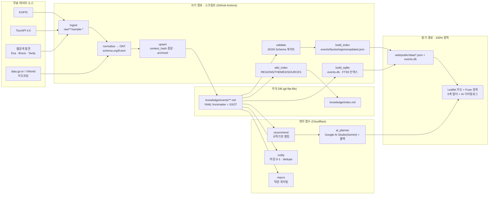
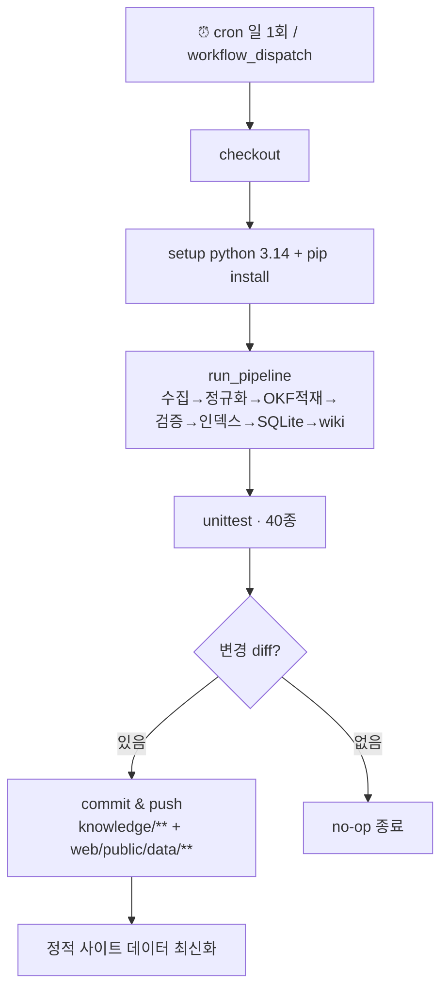
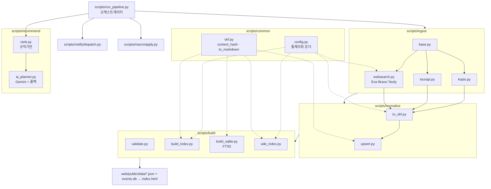

# 놓치마 (Notchima)

[](https://github.com/jellyggumi/happy-our-planning/actions/workflows/ingest.yml)
[](https://www.python.org/)
[](https://nodejs.org/)
[](tests/test_pipeline.py)
[](docs/02-data-model-okf.md)
[](docs/09-saas-free-stack.md)
[](docs/00-overview.md)

> **놓칠 뻔한 기회를 대신 챙겨주는 행사 비서.** 대한민국 지도 기반 **행사 발견 · 신청 매크로 · 마감 알람 · AI 주간 플래닝**.
공연·축제·전시·교육·공모·정부지원이 흩어져 마감을 놓치는 사람을 위해 — 지도에서 발견하고, 매크로로 신청하고, 알람으로 지키고, AI가 주간 일정으로 큐레이션한다.
무료 공공 API + flat-file 지식 DB(llm-wiki) + 무료 SaaS(free tier)로 **월 0원** 운영을 목표로 한다. <sub>(코드네임: happy-our-planning)</sub>

## 핵심 기능
- 🗺️ 지역(시/도·시군구) · 기간 · 나이대 · 테마 · 키워드 5축 검색
- 🤖 신청기간 내 신청 보조 매크로(자동/반자동, 약관 준수)
- 🔔 신규·신청오픈·마감임박·신청결과 알람(Telegram/Web Push)
- 🧠 프로필 기반 AI 주간 플랜 추천

## 설계 한 줄 요약
공공 API → 정규화(schema.org/Event = Open Knowledge Format) → **git 안의 Markdown 파일 = 지식 DB** →
사전 빌드 JSON → 정적 UI(검색/지도). 상태/AI/알람만 엣지 함수. 스크립트가 모든 적재·매크로·알람을 구동.

## 시스템 로직 (데이터 흐름)


## CI 워크플로우 (.github/workflows/ingest.yml)


## 구조 (모듈 그래프)


## 문서 (구체 설계)
| 문서 | 내용 |
|---|---|
| [docs/00-overview](docs/00-overview.md) | 비전·제약·성공기준 |
| [docs/01-architecture](docs/01-architecture.md) | 시스템 아키텍처·디렉터리 |
| [docs/02-data-model-okf](docs/02-data-model-okf.md) | OKF/schema.org 데이터 모델 |
| [docs/03-data-sources-apis](docs/03-data-sources-apis.md) | 무료 API 카탈로그 |
| [docs/04-ingestion-pipeline](docs/04-ingestion-pipeline.md) | 수집 파이프라인·지식 DB(llm-wiki) |
| [docs/05-search-and-map](docs/05-search-and-map.md) | 검색·지도 UI |
| [docs/06-application-macro](docs/06-application-macro.md) | 신청 매크로 |
| [docs/07-notifications](docs/07-notifications.md) | 결과 알람 |
| [docs/08-ai-planning](docs/08-ai-planning.md) | AI 추천 플래닝 |
| [docs/09-saas-free-stack](docs/09-saas-free-stack.md) | 무료 SaaS 스택 |
| [docs/10-roadmap-milestones](docs/10-roadmap-milestones.md) | 로드맵·마일스톤·리스크 |
| [docs/11-discovery-sqlite-ai](docs/11-discovery-sqlite-ai.md) | 웹검색 발견·SQLite·Gemini (2026 개선) |

## 레이아웃
```
docs/         계획 문서
knowledge/    지식 DB (llm-wiki: index.md + events/** + schema/)
config/       sources/regions/themes/age-bands 통제 어휘
scripts/      ingest(공공+웹검색) · normalize · build(+sqlite) · recommend(+gemini) · macro · notify
web/          정적 프런트엔드 (Leaflet + Fuse.js)
.github/      ingest 워크플로우 (일 1회 cron)
```

## 빠른 시작 (오프라인, 키 불필요)
샘플 fixture(`raw/**/sample-*`)로 전체 파이프라인이 네트워크 없이 돈다.
```bash
pip install -r requirements.txt
python -m scripts.run_pipeline          # 수집(웹검색 포함)→정규화→검증→인덱스→SQLite→wiki
python -m unittest discover -s tests    # 단위 테스트 40종
python -m scripts.ingest.websearch      # 웹검색 발견 후보(Exa/Brave/Tavily, 오프라인 픽스처)
python -m scripts.build.build_sqlite --query 축제   # SQLite FTS5 전문검색 데모
python -m scripts.recommend.rank        # 규칙기반 추천 + 주간 플랜(JSON)
python -m scripts.recommend.ai_planner  # Google AI Studio(Gemini) 플래너(+규칙 폴백)
python -m scripts.notify.dispatch       # 마감임박/신규 알람(드라이런)
python -m scripts.macro.apply           # 신청 매크로 잡 계획(약관 게이팅)

# 정적 사이트 미리보기
cd web/public && python -m http.server 8000   # → http://localhost:8000
```
실제 운영 시 `.env`(`.env.example` 참고)에 무료 API 키를 넣으면 어댑터가 원격 수집으로 전환.

## 지금 동작하는 것 (검증됨)
- ✅ KOPIS·TourAPI 어댑터 → schema.org/Event(OKF) Markdown 적재, content_hash 증분 upsert + archived 정책
- ✅ JSON Schema 검증 게이트, `events/facets/regions/updated.json` 빌드
- ✅ 정적 UI: Leaflet 지도 + 5축 필터(지역/기간/나이/테마/키워드) + Fuse 검색 + AI 추천 다이얼로그
- ✅ 규칙기반 추천/주간 플래너(무료, LLM 폴백), 마감임박 알람 + 중복억제
- ✅ 신청 매크로 잡 계획 + 약관 자동제출 게이팅(반자동 강등 보장)
- ✅ 지식 wiki 자동 인덱싱(REGIONS/THEMES/SOURCES)
- ✅ 웹검색 발견 레이어(Exa·Brave·Tavily) — 신뢰도/날짜/지역 가드로 OKF 후보 적재, `🔎 발견` 배지
- ✅ SQLite(libSQL) 파생 인덱스 `events.db` — FTS5 한국어 전문검색 + sido/theme/status 교차필터
- ✅ Google AI Studio(Gemini) 주간 플래너 — responseSchema JSON 강제 + 환각 가드 + 규칙 폴백

## 상태
M0–M2 코어 + M3–M6 검증 슬라이스 동작(샘플 데이터). 다음: 실 API 키 연결(원격 수집), Cloudflare Pages/Workers 배포, Playwright 매크로 러너 실행부, 시/도 경계 GeoJSON.
